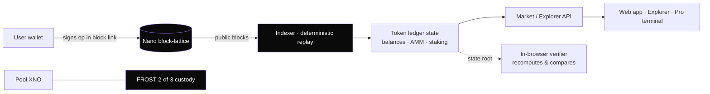

# HoldFun — a memecoin launchpad as a Nano (XNO) Layer-2

[](https://github.com/dhyabi2/holdergame/actions/workflows/ci.yml)
[](LICENSE)
[-4A90E2.svg)](https://nano.org)
[](nano/package.json)

**Live: [hodlgame.fun](https://hodlgame.fun)**

> **The creator can never own more than 5%, and holding is the game.** 95% of every
> token goes to the community; unstaking pays a 20% tax that burns 5% and hands the
> rest to everyone still staked. No contract can be rugged because there is no
> contract — the ledger is *replayed*, not executed.

HoldFun runs on **Nano (XNO)**: feeless, sub-second, energy-light. Nano has no smart
contracts, so HoldFun is a **deterministic Layer-2** — the entire token ledger
(balances, the AMM, staking, rewards) is computed by anyone replaying signed Nano
data blocks. The only real asset, the pool's XNO, sits in **threshold custody**
(FROST 2-of-3). Nobody — including the operator — can mint, freeze, or rug.



Every operation (launch, buy, sell, stake, unstake, claim, transfer, seed) is encoded
into the 32-byte `link` field of a Nano block. Because replay is pure and
deterministic, **two independent parties fold the same blocks into a byte-identical
state root** — that convergence *is* the trust model. The web app even ships the
indexer to the browser so a visitor can recompute the state from public RPC and
verify the server with their own machine.

## The rules — enforced by math, not by trust

| Rule | How it's enforced |
|------|-------------------|
| **5% creator cap** | Creator share is `floor(supply × 5%)`, computed structurally at launch. No one can request more. |
| **Supply locked** | Nothing mints after launch. Supply only ever *decreases*, via the burn. |
| **Trading** | Constant-product AMM (XNO ⇄ token) with a **1% fee** retained in the pool. |
| **Holding is the game** | Staking earns a share of the XNO rebate vault, distributed **pro-rata by stake** (a bounded `rewardPerShare` accumulator — *not* block height, which an account can inflate). |
| **Exit tax** | **Unstaking** pays a 20% tax: **5% burned** (permanent deflation) + **15% redistributed** to everyone still staked. |
| **Consensus decimals** | A token's decimals are pinned in its launch block byte, so every indexer agrees on scale without trusting metadata. |
| **Keyless ledger** | Pool accounts are **derived from chain data**; there is no admin key over the token ledger. |

## Features

- **Deterministic token ledger** — pure state machine, replayable, byte-identical across parties ([`nano/core`](nano/core)).
- **On-chain everything** — ops, slippage-protected trades (fragment links), signed metadata, signed comments, and metadata-authority anchors all live in Nano blocks.
- **AMM + staking + rewards** — constant-product swaps, stake-to-earn XNO rebates, exit-tax deflation.
- **FROST 2-of-3 custody** — the pool's XNO is held by a threshold signer set with pool-key rotation ([`docs/FROST-CUSTODY.md`](nano/docs/FROST-CUSTODY.md)).
- **Etherscan-style Explorer** — global op feed, op detail with raw-block hexdump + state deltas, token/account pages, proof-of-reserves, and **in-browser verification** ([`docs/EXPLORER-SPEC.md`](nano/docs/EXPLORER-SPEC.md)).
- **Pro trading terminal** — `/pro`: candlestick chart, order ticket with live quote + hotkeys, AMM depth curve, live trade tape, holders.
- **Exchange Integration Kit** — headless deposit/withdrawal, balance proofs, and Merkle balance proofs for listing a token ([`docs/EXCHANGE-KIT.md`](nano/docs/EXCHANGE-KIT.md)).
- **Trustless continuity** — snapshots anchored on-chain, chain-derived settlement (no private ledgers), and a documented "if the founder disappears" recovery path ([`docs/TRUSTLESS-ROADMAP.md`](nano/docs/TRUSTLESS-ROADMAP.md)).
- **Security-hardened** — a break-the-validation audit enumerated every gate and broke each with a runnable PoC; confirmed breaks are fixed ([`docs/SECURITY-AUDIT.md`](nano/docs/SECURITY-AUDIT.md)).

## Quick start

```bash
cd nano
npm install
npm test              # 31 offline, deterministic suites (the trust model)
npm run build-workgen # compile the local PoW helper (optional)
npm run live-smoke    # read real Nano blocks from a public node (network)
```

Run the web app locally:

```bash
cd nano/web
npm install
npm run dev           # Next.js app: explore · trade · create · scan · wallet · /pro
```

## Repository layout

```
nano/                 the active project (Node + TypeScript, Next.js web app)
  core/               deterministic token ledger + op encoding — the trust model
  indexer/            reads Nano blocks and folds them into state
  server/             market/explorer/exchange APIs, FROST signer, settlement
  client/             Nano Ed25519-blake2b signing + headless exchange client
  lib/                RPC, layered PoW (cache→rpc→C→WASM), Shamir splitting
  scripts/            live smoke tests, e2e, FROST migration, Shamir split
  web/                Next.js app — vendors core/indexer/server/lib/client (see below)
  docs/               SECURITY-AUDIT · FROST-CUSTODY · EXPLORER-SPEC · EXCHANGE-KIT · TRUSTLESS-ROADMAP · bpmn/
  SPEC.md             encoding + state-machine spec
archive/solana/       the previous Solana implementation (frozen)
MIGRATION-XNO.md      the full Solana → Nano migration proposal
```

> **Vendored copies:** `nano/web` re-includes `core/`, `indexer/`, `server/`, `lib/`,
> and `client/` so Vercel ships a self-contained app. These are synced by hand and a
> **CI drift gate blocks any merge where the audited code ≠ the deployed code**. If
> you edit a shared file, copy it into `nano/web/` in the same change. See
> [CONTRIBUTING.md](CONTRIBUTING.md).

## Documentation

| Doc | What it covers |
|-----|----------------|
| [`nano/SPEC.md`](nano/SPEC.md) | Byte encoding + the deterministic state machine |
| [`MIGRATION-XNO.md`](MIGRATION-XNO.md) | Why & how HoldFun moved from Solana to Nano |
| [`docs/SECURITY-AUDIT.md`](nano/docs/SECURITY-AUDIT.md) | The break-the-validation method + confirmed fixes |
| [`docs/FROST-CUSTODY.md`](nano/docs/FROST-CUSTODY.md) | Threshold custody of pool XNO + key rotation |
| [`docs/EXPLORER-SPEC.md`](nano/docs/EXPLORER-SPEC.md) | The full Etherscan-parity explorer design |
| [`docs/EXCHANGE-KIT.md`](nano/docs/EXCHANGE-KIT.md) | Listing a token on an exchange |
| [`docs/TRUSTLESS-ROADMAP.md`](nano/docs/TRUSTLESS-ROADMAP.md) | Founder-independent continuity |

## Contributing & security

- **Contributing:** [CONTRIBUTING.md](CONTRIBUTING.md) — setup, the vendored-drift rule, tests, PR expectations.
- **Security disclosure:** [SECURITY.md](SECURITY.md) — please report vulnerabilities privately.
- **Conduct:** [CODE_OF_CONDUCT.md](CODE_OF_CONDUCT.md).
- **Changes:** [CHANGELOG.md](CHANGELOG.md).

## License

[Apache 2.0](LICENSE).
