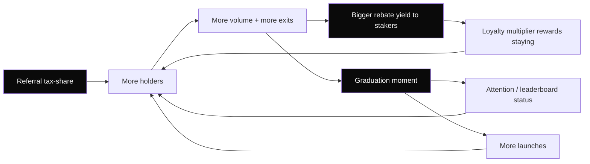

# HodlGame Growth Mechanics — endogenous game theory

> **Scope note (Direct-Settlement v2, 2026-08-22):** everything below about pool
> accounts, custody, and the sweep applies **only to legacy pooled tokens**
> (launched with opcode `0x01`). v2 zero-custody tokens (opcode `0x0b`) have no
> pool account: the sweep skips them entirely and settlement is wallet-to-wallet
> at trade time. See `../SPEC.md` §8 (or `nano/SPEC.md` from the repo root).

> How HodlGame manufactures activity and virality **from within the protocol** —
> self-reinforcing incentive loops encoded in the deterministic state machine,
> funded only by value that already flows through the system. No external
> treasury, no paid acquisition, no emissions, no determinism breaks.
>
> Produced with the Brainstorming methodology (5 parallel branches: referral,
> retention, launch, status, sybil), then reconciled against HodlGame's real
> mechanics and constraints.

## The one idea everything else hangs on

HodlGame already has a **positive-sum-to-hold / value-leaks-on-exit** core: the
20% unstake tax is paid **in full, pro-rata, to everyone still staked**. So
in any token with real interest, the Nash equilibrium for a rational holder is:

> **hold, and recruit more holders** — because (a) your rebate grows every time
> someone else exits, and (b) more holders = more future exits = more rebates.

Every mechanism below is a lever on that same flywheel. The design rule is
**incentive conservation**: growth is paid for by redistributing value the
protocol already captures (exit taxes, swap fees, the attention of a ranked
feed), never by minting new supply or spending an external budget.

## The cross-cutting anti-sybil principle

Every reward in this document is **gated behind capital that pays the exit tax**,
and **no reward pays out more than it costs to extract**. That single rule kills
sybil farming without any identity oracle:

- To earn, you must stake real XNO-backed tokens; to withdraw them you pay the
  20% unstake tax. A farm of N wallets locks N× capital and pays the tax N times.
- Any "one-account-one-weight" surface (votes, tournament eligibility) uses a
  **concave weight** `w = floor(isqrt(bond))` **plus a minimum bond**, so
  splitting a stake across wallets never increases influence and the minimum bond
  makes micro-wallets unviable.
- Self-dealing is always net-negative: routing value to your own second wallet
  first requires that wallet to pay the tax/fee the reward is a fraction of.

This is deterministic (pure integer math over the replayed ledger) and
third-party-verifiable, like everything else in the L2.

---

## Mechanisms, ranked by impact ÷ effort

### 1. Referral tax-share — the viral engine  ·  impact ★★★★★ · effort ★★★☆☆

**What.** A referee is permanently bound to one referrer the first time they
touch a token via a referral link. The referrer then earns a fixed slice
(e.g. **2 of the 20** tax points, i.e. 10% of the tax) of every unstake tax the
referee later pays — drawn from the pool, credited to the referrer's claimable
balance.

**Game theory.** This makes every holder a self-interested, self-policing
marketer. Your referral income is maximized by recruiting **high-intent,
long-term** holders (they trade and eventually pay tax) and is worthless if you
spam low-quality wallets (they never stake, never pay tax). Crucially, referral
income is a *share of a cost the referee pays* — so referrers are aligned with
the protocol, not extracting from it.

**Deterministic encoding.** A one-time `referred-by` op (first-write-wins,
immutable) binds `referee → referrer` in replayed state; the indexer builds an
immutable `ReferralMap` from public blocks. On each unstake, settlement splits
the tax `18% stakers / 2% referrer` and credits the referrer's banked
XNO (claimed with the existing `claim` op; on legacy pooled tokens paid from pool custody — on v2 zero-custody tokens rewards are token-denominated and settle like any other position). All
arithmetic, fully re-derivable.

**Sybil/collusion.** Self-referral rejected (`referee == referrer`). Farming is
irrational: to collect the 2-point rebate the sybil referee must first lock
capital and pay the full 20% tax — a guaranteed net loss. No cycles (binding is
acyclic by first-write-wins).

**Virality.** Referral earnings are visible and compounding ("earned from your
network"), so users share links to real communities. This is the loop that turns
one holder into a recruiting tree.

### 2. Bonding-curve launch + graduation moment  ·  impact ★★★★★ · effort ★★★★☆

**What.** New tokens launch on a deterministic bonding curve (price rises as XNO
comes in) and **graduate** to the full constant-product AMM when pool XNO crosses
a fixed threshold. Graduation is a discrete, celebratory, shareable event.

**Game theory.** A Schelling coordination game: everyone wants to buy *before*
graduation because graduation → featured listing → more buyers → higher price.
The belief is self-fulfilling, which is exactly what drives the pre-graduation
buying frenzy that makes launchpads active. The threshold is a clear, common
goal that a token's community rallies toward.

**Deterministic encoding.** The launch op pins the graduation target (a byte, as
decimals already are); the state machine runs curve pricing until
`poolXno ≥ target`, then flips a `graduated` flag and hands the reserves to the
standard AMM. Pure state transition, no dev control, no oracle.

**Sybil/collusion.** Curve buys pay the same 1% fee; wash-trading to fake
progress costs real fee each round and still requires genuine XNO to cross the
threshold. The 5% creator cap prevents the creator from self-graduating cheaply.

**Virality.** The graduation moment is the unit of word-of-mouth ("X just
graduated"). A live "graduating soon" rail turns the whole feed into a countdown.

### 3. Diamond-hand loyalty multiplier — retention  ·  impact ★★★★☆ · effort ★★☆☆☆

**What.** Each staker carries a **loyalty multiplier** on their *own* rebate
share that starts at 1.0, ratchets up the longer they go without unstaking
(incremented per rebate epoch, **not** per block height), and **resets/decays on
any unstake**. Capped (e.g. 1.0–2.0) so it rewards commitment without permanently
crowding out newcomers.

**Game theory.** A personal commitment device: dumping doesn't just cost the 20%
tax, it **destroys future yield efficiency**, making the true cost of exit higher
than the headline tax. Rational holders sit tight; the marginal staker prefers to
hold rather than churn.

**Deterministic encoding.** Height-free by construction — the multiplier advances
on protocol **rebate epochs** (a count of distribution events, which are
deterministic), and multiplies into the existing bounded `rewardPerShare`
accounting. Store a per-account small integer; no timestamps.

**Sybil/collusion.** Multiplier is per-wallet and non-transferable; splitting a
stake creates several low-multiplier accounts, never one high one. Cap bounds any
whale advantage.

**Virality.** A public "diamond hands" leaderboard (highest multipliers) turns
retention into visible status (feeds mechanism 4).

### 4. Tournaments, leaderboards & derived reputation — status  ·  impact ★★★★☆ · effort ★★☆☆☆

**What.** Purely **derived** (indexer-computed, no new on-chain writes) status
surfaces: token tournaments (rank by 24h post-graduation volume), holder ranks,
a creator reputation score, and badges — with the **prize being visibility**
(priority placement in the feed), which is free to grant and directly converts to
real volume.

**Game theory.** Status is a positional good; making activity the only way to
climb turns growth into a competition people run *for you*. Because the prize is
attention (not a subsidy), it costs the protocol nothing and can't be farmed for
extractable value.

**Deterministic encoding.** Nothing new on-chain — reputation is a pure function
of the already-replayed history (capital-at-risk over time, tokens graduated,
realized rebates, burn contribution). Any third party recomputes the exact
leaderboard from public blocks.

**Sybil/collusion.** This is the part that is *easy to get wrong*, so it is
worth stating precisely. Naive boards (rank by raw volume / raw holder count /
mark-to-market price) are **cheap to fake on a feeless chain** — wash trading,
dust-sybil holder crowds, and thin-pool price spikes all cost ~nothing. The
implemented boards (`server/leaderboards.ts`) are hardened to rank only on
things that cost real, at-risk capital:

- **Value = redeemable, not mark price.** A holder's "value" is what the pool
  would actually pay to sell their balance now (constant product), so a fake high
  price on a dry pool redeems to ~0 and buys no whale rank.
- **Creator size = real pooled XNO**, never market cap — fake price contributes
  nothing; only XNO actually locked in pools counts.
- **Liquidity gate.** Zero-pool tokens are untradeable and free to spawn, so they
  are excluded from every economic board (volume/gainers/holders/new).
- **Holder rank = significant holders**, counted from the top-holders set (dust
  accounts holding 1 raw never enter it), not the raw holder count.
- **Volume board ordered by distinct traders first**, then volume — a single
  account looping buy/sell can't climb it; adding fake traders now costs real XNO
  per wallet (capital-gated).

**Residuals (honest).** Two vectors are reduced but not eliminated without more:
(a) a determined attacker can still fund N wallets to be N distinct traders/
significant holders — but this is now *capital-gated* (each wallet must buy real
XNO), not free; the **launch bond (#5)** and **referral binding (#1)** raise that
cost further. (b) The *displayed* raw holder count can still include dust; boards
never rank on it, but if we want a dust-free displayed count we need an
indexer-level "holders above a value floor", which requires the full holder set
(not just top-N). Tracked as future work. The rule stands: **no board ranks on a
free-to-fake metric; every ranking signal is gated behind real, at-risk XNO.**

**Virality.** Leaderboards and badges are inherently shareable and create
aspirational entry ("I want that badge / that rank").

### 5. Refundable launch bond — spam policy  ·  impact ★★★☆☆ · effort ★★☆☆☆

**What.** Launching requires a refundable XNO bond, **returned on graduation** and
**forfeited (burned + partly to the graduating-token reserve) on failure/abandon**.

**Game theory.** A capital gate that makes the feed high-signal: serious creators
pay nothing net (refunded), spammers pay per attempt. Filters noise without any
gatekeeper.

**Deterministic encoding.** The bond is an XNO deposit chained to the launch op
(same value-binding pattern already used for seed liquidity); refund/forfeit is a
deterministic settlement outcome on the graduation flag.

**Sybil/collusion.** 100 spam launches = 100 bonds locked; concentrating on one
quality launch strictly dominates.

**Virality.** Indirect — a spam-free, high-signal feed is what makes the whole app
worth sharing.

---

## Policies (the rules that keep the loops honest)

1. **Incentive conservation.** Growth is only ever funded by redistributing
   value already captured (exit taxes, swap fees, attention). Never mint supply
   or spend an external budget for growth. Guarantees sustainability — the
   opposite of Ponzi emissions.
2. **Trust-minimization is a growth feature.** The 5% creator cap, locked supply,
   keyless chain-derived pools, and in-browser verification lower the risk of
   sharing a token. People evangelize what they can't be rugged by; make every
   token page display its trust proofs.
3. **Fair launch only.** No presale, no team allocation beyond the structural 5%;
   everyone buys on the same curve. Fairness is itself viral (no "insiders dumped
   on me" story).
4. **Everything derived, nothing decreed.** Ranks, badges, referral trees, and
   reputation are all recomputable from public blocks. No admin can grant or
   revoke status — which is what makes the status real and worth competing for.
5. **Rewards ≤ extraction cost.** Every incentive sits behind capital that pays
   the exit tax, so no loop can be drained by sybils or self-dealing.

## Suggested build order

1. **Derived status + leaderboards (4)** — zero new on-chain ops, pure
   indexer/UI; ships fastest and immediately raises engagement.
2. **Referral tax-share (1)** — one new immutable `referred-by` op + a settlement
   split; the highest-leverage viral primitive.
3. **Loyalty multiplier (3)** — a small per-account integer folded into existing
   rebate accounting.
4. **Bonding curve + graduation (2)** — the biggest activity driver but the
   largest state-machine change; do it deliberately, with tests pinning the curve
   and the graduation transition.
5. **Launch bond (5)** — a policy layer on top of launch, reusing value-binding.

## Anti-patterns explicitly rejected

- Emissions / yield farming with printed tokens (unsustainable, breaks supply
  lock).
- Any reward keyed on per-account block height (attacker-inflatable — forbidden).
- External referral bounties or marketing spend (not endogenous; not verifiable).
- First-mover advantages that permanently out-yield newcomers (deters entry — the
  loyalty multiplier is capped to avoid this).
- Wash-trade-rewardable metrics (down-weight self-trades; reward net new holders).
